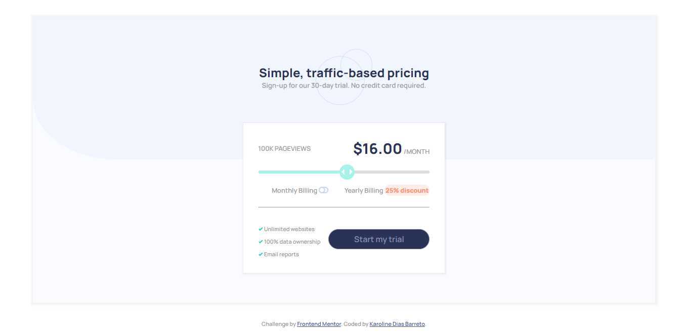
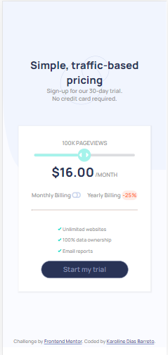

# Frontend Mentor - Interactive pricing component

What i used:
- Concepts of flexbox
- HTML5, CSS3 and the framework VueJS

Link:
- https://interactive-pricing-component-vert-omega.vercel.app/  

Screenshots of challenge finished:
- Web:  
    
- Mobile:  
  
